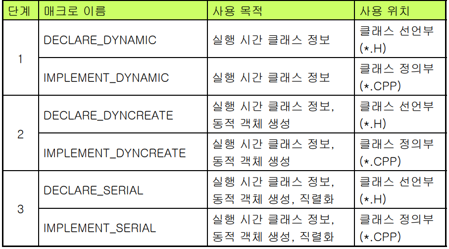

## 1. CObject 클래스

### 1. CObject란?
- `CObject`는 **MFC 클래스 계층의 최상위 클래스**
- 거의 모든 MFC 클래스가 이걸 상속받아서 만들어져 있음
- 제공하는 기능(멤버 함수)을 **서비스**라고 부름

>**CObject의 서비스 = CObject가 제공하는 공통 기능**

### 2. CObject 서비스

| 서비스 이름 | 기능 |
| ---------- | ---- |
| 실행 시간 클래스 정보 | 객체의 클래스 정보를 실행 시간에 알 수 있음 <br> (`IsKindOf()`, `RUNTIME_CLASS()`) |
| 동적 객체 생성 | 객체를 런타임에 클래스 이름으로 생성할 수 있음 <br> (`DECLARE_DYNAMIC`, `IMPLEMENT_DYNAMIC`) |
| 직렬화 | 객체를 파일이나 메모리로 저장하고 다시 불러올 수 있음 <br> (`Serialize(Archive&)`) |
| 타당성 점검 | 객체 상태를 점검한다. |
| 집합 클래스와의 호환성 | 서로 다른 클래스 객체를 집합 클래스에 저장할 수 있도록 한다. |

<br>

#### 실행 시간 클래스 정보 기능 추가
```cpp
// MyClass.h
class CMyClass : public CObject
{
    DECLARE_DYNAMIC(CMyClass)
    ...
}

// MyClass.cpp
#include "MyClass.h"

IMPLEMENT_DYNAMIC(CMyClass, CObject)
...

// 사용 예시
BOOL IsMyClass(CObject *pObj)
{
    // pObj가 가리키는 객체가 CMyClass 타입인지 확인한다.
    if(pObj->IsKindOf(RUNTIME_CLASS(CMyClass))){
        ...
    }
    else{
        ...
    }
}
```

#### 동적 객체 생성
```cpp
// MyClass.h
class CMyClass : public CObject
{
    DECLARE_DYNCREATE(CMyClass)
public:
    CMyClass();
    ...
};

// MyClass.cpp
#include "MyClass.h"

IMPLEMENT_DYNCREATE(CMyClass, CObject)
...

// 사용 예시
// 객체를 동적으로 생성한다.
CRuntimeClass* pRuntimeClass = RUNTIME_CLASS(CMyClass);
CObject* pObject = pRuntimeClass->CreateObject();

// 객체를 성공적으로 생성했는지 여부를 확인한다.
ASSERT(pObject->IsKindOf(RUNTIME_CLASS(CMyClass)));

```

#### 직렬화
```cpp
// MyClass.h
class CMyClass : public CObject
{
    DECLARE_SERIAL(CMyClass)
public:
    CMyClass();
    virtual void Serialize (CArchive& ar);
    ...
}

// MyClass.cpp
#include "MyClass.h"

IMPLEMENT_SERIAL(CMyClass, CObject, 1)

void CMyClass::Serialize (CArchive& ar)
{
    // CObject가 제공하는 가상 함수인 Serialize() 함수를 재정의한다.
}
```


#### 3단계 매크로


#### 타당성 점검
```cpp
// MyClass.h
class CMyClass : public CObject
{
    // 멤버 변수
    int m_start;
    int m_end;
public:
    virtual void AssertValid() const;
    ...
}

// MyClass.cpp
#include "MyClass.h"

virtual void CMyClass::AssertValid() const
{
    CObject::AssertValid();
    ASSERT(m_start > 0);
    ASSERT(m_end < 100);
}
...
```

### 3. 집합 클래스와의 호환성
| 종류 | 클래스 이름 |
| ---- | --------- |
| 배열 | CObArray, CArray(템플릿 클래스) |
| 리스트 | CObList, CList(템플릿 클래스) |
| 맵 | CMapWordToOb, CMapStringToOb, CMap(템플릿 클래스) |


