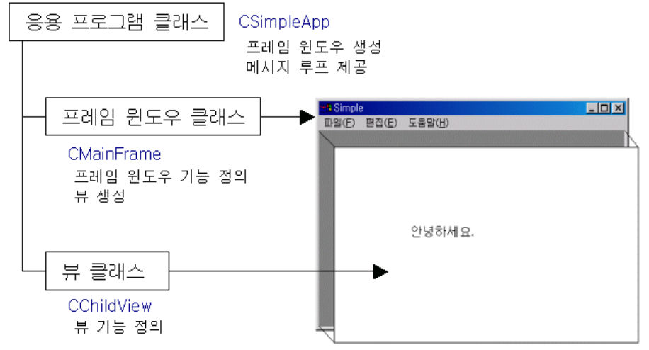

## 주요 클래스


### 응용 프로그램 클래스
```cpp
// Simple.h
// 응용 프로그램 클래스 선언부
class CSimpleApp : public CWinApp
{
public:
    CSimpleApp();                      // 생성자 (프로그램 초기화 전 수행됨)
    virtual BOOL InitInstance();       // 애플리케이션 초기화 함수 (main 역할)
    afx_msg void OnAppAbout();         // "About" 메뉴 명령이 실행될 때 호출되는 핸들러
    DECLARE_MESSAGE_MAP()              // 메시지 맵을 선언 (메시지-함수 매핑용 매크로)
};

```
```cpp
// Simple.cpp
// 메시지 맵 정의
// BEGIN_MESSAGE_MAP(클래스명, 부모클래스명)
BEGIN_MESSAGE_MAP(CSimpleApp, CWinApp)
    ON_COMMAND(ID_APP_ABOUT, OnAppAbout) // ID_APP_ABOUT 명령이 들어오면 OnAppAbout() 호출
END_MESSAGE_MAP()

// CSimpleApp 생성자
CSimpleApp::CSimpleApp()
{
    // 생성자에서는 주로 멤버 변수 초기화 수행
}

// 전역(정확히는 전역 객체)으로 애플리케이션 인스턴스 생성
// 프로그램이 실행되면 이 객체가 자동으로 생성되어 WinMain 대신 실행됨
CSimpleApp theApp;

```

```cpp
// InitInstance() - 프로그램 시작점
BOOL CSimpleApp::InitInstance()
{
    // 프로그램의 설정(예: INI 파일, 레지스트리 키 등)을 어디에 저장할지 지정
    SetRegistryKey(_T("Local AppWizard-Generated Applications"));

    // 메인 프레임(창) 객체 동적 생성
    CMainFrame* pFrame = new CMainFrame;

    // CWinApp의 멤버 변수 m_pMainWnd는 프로그램의 주 윈도우 포인터를 가리킴
    m_pMainWnd = pFrame;

    // 프레임(메인 윈도우) 로드
    //   IDR_MAINFRAME : 리소스 ID (메뉴, 아이콘, 제목 등)
    //   WS_OVERLAPPEDWINDOW | FWS_ADDTOTITLE : 윈도우 스타일
    //   NULL, NULL : 부모 윈도우, 생성 파라미터 없음
    pFrame->LoadFrame(IDR_MAINFRAME, WS_OVERLAPPEDWINDOW | FWS_ADDTOTITLE, NULL, NULL);

    // 프레임 윈도우를 화면에 표시
    pFrame->ShowWindow(SW_SHOW);

    // 윈도우 클라이언트 영역을 다시 그리기
    pFrame->UpdateWindow();

    // TRUE를 반환하면 프로그램이 정상 실행됨 (FALSE면 종료)
    return TRUE;
}

```

```cpp
// 대화상자 관련 클래스 선언 및 정의 부분 - 생략
// ...
// "도움말 → About" 메뉴를 클릭했을 때 실행되는 함수
void CSimpleApp::OnAppAbout()
{
    CAboutDlg aboutDlg;   // About 대화상자 객체 생성
    aboutDlg.DoModal();   // 모달(닫을 때까지 다른 작업 불가) 대화상자로 실행
}

```

### 프레임 윈도우 클래스
```cpp
// MainFrm.h
// 메인 프레임 윈도우 클래스 선언부
// 응용 프로그램의 기본 윈도우(틀, 메뉴, 툴바 등)를 담당함

class CMainFrame : public CFrameWnd  // CFrameWnd를 상속받아 윈도우의 기본 기능을 확장
{
public:
    CMainFrame();  // 생성자: 프레임 초기화 시 호출됨

protected:
    DECLARE_DYNAMIC(CMainFrame)
    // 런타임 클래스 정보를 제공하기 위한 매크로
    // (RTTI 기능처럼, MFC의 객체 생성 및 타입 확인에 사용됨)

public:
    virtual BOOL PreCreateWindow(CREATESTRUCT& cs);
    // 윈도우가 생성되기 전에 호출되는 함수
    // CREATESTRUCT를 수정하여 윈도우 스타일, 크기, 제목 등을 설정할 수 있음

    virtual BOOL OnCmdMsg(UINT nID, int nCode, void* pExtra, AFX_CMDHANDLERINFO* pHandlerInfo);
    // 명령 메시지(버튼 클릭, 메뉴 선택 등)를 처리하거나 전달할 때 호출되는 함수
    // 일반적으로 프레임 → 뷰로 명령을 전달할 때 사용됨

    virtual ~CMainFrame();  // 소멸자: 프레임 종료 시 호출됨

    CChildView m_wndView;
    // 클라이언트 영역에 표시될 뷰 클래스 객체
    // 실제 그리기나 입력 처리를 담당하는 영역

protected:
    afx_msg int OnCreate(LPCREATESTRUCT lpCreateStruct);
    // 프레임 윈도우가 생성될 때 자동으로 호출됨 (WM_CREATE 메시지 처리)
    // 툴바, 상태바, 메뉴 등을 생성하는 코드가 들어감

    afx_msg void OnSetFocus(CWnd* pOldWnd);
    // 포커스가 프레임 윈도우로 올 때 호출됨
    // 일반적으로 m_wndView(뷰 객체)에 포커스를 넘겨주는 역할을 함

    DECLARE_MESSAGE_MAP()
    // 메시지 맵 매크로: 메시지와 처리 함수를 연결함
    // BEGIN_MESSAGE_MAP / END_MESSAGE_MAP 블록과 함께 사용
};

```

```cpp
// MainFrm.cpp
// CMainFrame 클래스 구현부
// 메인 프레임 윈도우 생성, 포커스 설정, 명령 메시지 라우팅 등을 담당함

IMPLEMENT_DYNAMIC(CMainFrame, CFrameWnd)
// 런타임에 클래스 정보를 제공하기 위한 매크로
// (DECLARE_DYNAMIC과 짝을 이룸)

BEGIN_MESSAGE_MAP(CMainFrame, CFrameWnd)
    ON_WM_CREATE()      // WM_CREATE 메시지를 OnCreate()로 연결
    ON_WM_SETFOCUS()    // WM_SETFOCUS 메시지를 OnSetFocus()로 연결
END_MESSAGE_MAP()

// 생성자
CMainFrame::CMainFrame()
{
    // 프레임 윈도우 생성 시 필요한 초기화 코드를 넣을 수 있음
}

// 소멸자
CMainFrame::~CMainFrame()
{
    // 프레임 종료 시 정리할 리소스가 있으면 여기에 작성
}

// -------------------- 프레임 윈도우 생성 시 호출 --------------------
int CMainFrame::OnCreate(LPCREATESTRUCT lpCreateStruct)
{
    // 기본 CFrameWnd의 OnCreate를 먼저 호출 (필수)
    if (CFrameWnd::OnCreate(lpCreateStruct) == -1)
        return -1;

    // 클라이언트 영역(View)을 생성
    // Create(클래스명, 윈도우 이름, 스타일, 위치, 부모, ID, ... )
    if (!m_wndView.Create(
        NULL, NULL, AFX_WS_DEFAULT_VIEW, 
        CRect(0, 0, 0, 0), this, AFX_IDW_PANE_FIRST, NULL))
    {
        TRACE0("Failed to create view window\n");  // 디버그 콘솔 출력
        return -1;
    }

    return 0;   // 성공 시 0 반환
}

// -------------------- 윈도우 생성 전에 호출됨 --------------------
BOOL CMainFrame::PreCreateWindow(CREATESTRUCT& cs)
{
    // 부모 클래스의 설정을 먼저 수행
    if (!CFrameWnd::PreCreateWindow(cs))
        return FALSE;

    // 윈도우의 외곽선 스타일 제거 (클라이언트 영역 테두리 없앰)
    cs.dwExStyle &= ~WS_EX_CLIENTEDGE;

    // 등록된 기본 윈도우 클래스를 사용
    cs.lpszClass = AfxRegisterWndClass(0);

    // cs 구조체를 수정하여 프레임의 속성을 조정할 수 있음
    // 예: 창 크기, 배경색, 제목 등 변경 가능
    return TRUE;
}

// -------------------- 포커스가 프레임으로 올 때 호출됨 --------------------
void CMainFrame::OnSetFocus(CWnd* pOldWnd)
{
    // 프레임이 아닌, 클라이언트 뷰에 포커스를 넘겨줌
    m_wndView.SetFocus();
}

// -------------------- 명령 메시지 처리 --------------------
BOOL CMainFrame::OnCmdMsg(UINT nID, int nCode, void* pExtra, AFX_CMDHANDLERINFO* pHandlerInfo)
{
    // 먼저 뷰(View)에게 메시지를 전달 시도
    if (m_wndView.OnCmdMsg(nID, nCode, pExtra, pHandlerInfo))
        return TRUE;    // 뷰가 메시지를 처리했다면 여기서 종료

    // 뷰가 처리하지 않았다면, 프레임이 처리 시도
    return CFrameWnd::OnCmdMsg(nID, nCode, pExtra, pHandlerInfo);
}


```


### 뷰 클래스
```cpp
// ChildView.h
// 프레임 내부 클라이언트 영역(View)를 담당하는 클래스
// 실제 그리기, 입력 처리 등 화면 표시 역할 수행

class CChildView : public CWnd   // CWnd를 상속받아 기본 윈도우 기능 확장
{
public:
    CChildView();  // 생성자: 객체 초기화

protected:
    virtual BOOL PreCreateWindow(CREATESTRUCT& cs);
    // 윈도우가 생성되기 직전에 호출됨
    // CREATESTRUCT를 수정하여 윈도우 스타일, 크기, 클래스 등을 조정 가능
    // 예: 배경색, 테두리, 위치 등

public:
    virtual ~CChildView();  // 소멸자: 객체 종료 시 호출

protected:
    afx_msg void OnPaint();
    // WM_PAINT 메시지가 들어올 때 호출
    // 화면을 다시 그리는 코드(OnDraw) 작성

    DECLARE_MESSAGE_MAP()
    // 메시지 맵 선언: 메시지와 처리 함수를 연결
    // BEGIN_MESSAGE_MAP / END_MESSAGE_MAP와 함께 사용
};

```

```cpp
// ChildView.cpp
// CChildView 클래스 구현부
// 프레임 내부 클라이언트 영역의 윈도우 생성과 화면 그리기를 담당

CChildView::CChildView()
{
    // 생성자: 객체 초기화
    // 현재는 특별한 초기화 코드 없음
}

CChildView::~CChildView()
{
    // 소멸자: 객체 종료 시 정리 코드
    // 현재는 특별한 종료 처리 없음
}

// -------------------- 메시지 맵 --------------------
BEGIN_MESSAGE_MAP(CChildView, CWnd)
    ON_WM_PAINT()      // WM_PAINT 메시지를 OnPaint()와 연결
END_MESSAGE_MAP()

// -------------------- 윈도우 생성 전 처리 --------------------
BOOL CChildView::PreCreateWindow(CREATESTRUCT& cs)
{
    // 부모 클래스의 PreCreateWindow 호출
    if (!CWnd::PreCreateWindow(cs))
        return FALSE;

    // 클라이언트 영역 테두리 제거
    cs.dwExStyle &= ~WS_EX_CLIENTEDGE;
    cs.style &= ~WS_BORDER;

    // 윈도우 클래스 등록 및 스타일 설정
    cs.lpszClass = AfxRegisterWndClass(
        CS_HREDRAW | CS_VREDRAW | CS_DBLCLKS,  // 수평/수직 리페인트, 더블클릭 허용
        ::LoadCursor(NULL, IDC_ARROW),         // 기본 커서 지정
        HBRUSH(COLOR_WINDOW+1),                // 배경색 지정 (흰색)
        NULL                                   // 아이콘 없음
    );

    return TRUE;  // 윈도우 생성 가능
}

// -------------------- 화면 갱신 처리 --------------------
void CChildView::OnPaint()
{
    CPaintDC dc(this);  // 디바이스 컨텍스트(DC) 생성, WM_PAINT 자동 처리

    // 텍스트 출력: (x=100, y=100) 위치에 "안녕하세요." 출력
    dc.TextOut(100, 100, CString("안녕하세요."));
}

```

### 요약
| 클래스 종류 | 베이스 클래스 이름 | 핵심 함수 - 주 역할 |
| ---------- | ----------------- | ----------------- |
| 응용 프로그램 클래스 | CWinApp | InitInstance() - 프레임 윈도우를 생성한다. <br> Run() - 메시지 루프를 제공한다. |
| 프레임 윈도우 클래스 | CFrameWnd | OnCreate() - 뷰를 생성한다. |
| 뷰 클래스 | CWnd | OnPaint() - 화면에 출력한다. |

